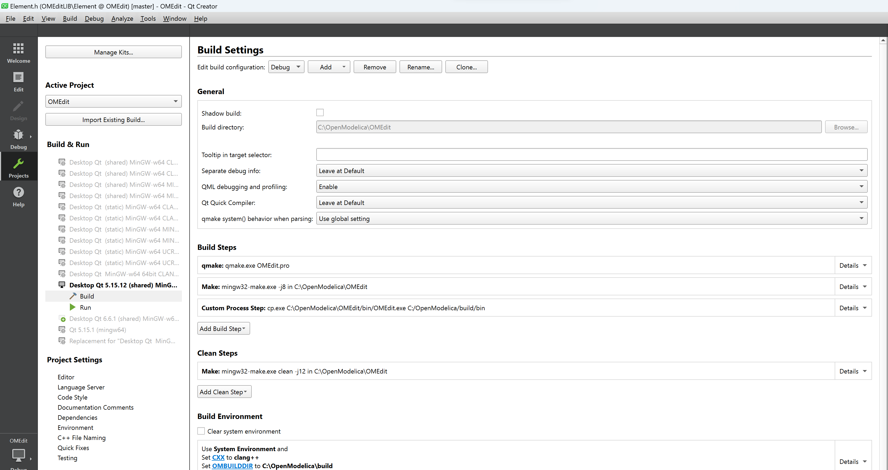

# OMEdit
A Modelica connection editor for OpenModelica.

## Dependencies

  - [OpenModelica Compiler](../OMCompiler)
  - [OMPlot](../OMPlot)
  - [OMSimulator](../../../../OMSimulator)

## Build instructions

Follow the instructions matching your OS:

  - [OMCompiler/README.Linux.md](../OMCompiler/README.Linux.md)
  - [OMCompiler/README.Windows.md](../OMCompiler/README.Windows.md)

### Compile/Debug from Qt Creator

Compile OMEdit once using the build instructions above so all dependencies of OMEdit are ready. Then follow these steps,

  - Load the `OMEdit.pro` file in Qt Creator.
  - Configure the project with the compiler you used to compile OMEdit earlier.
  - Go to project build settings in Qt Creator. Add a custom build step to copy executable `OMEdit` from `OpenModelica/OMEdit/bin` to `OpenModelica/build/bin`
  - Add the build environment variables `CXX` and `OMBUILDDIR`. `CXX` is only needed if your default is `gcc` and you want to use `clang`. `OMBUILDDIR` should point to `OpenModelica/build`.
  - Change the run settings to run the executable `OpenModelica/build/bin/OMEdit` instead of `OpenModelica/OMEdit/bin/OMEdit`.
  - Compile/debug OMEdit.

## Coding Style

  - 2 spaces not tab
  - CamelCase except that first letter should be small.
  - Member variables should start with `m` and member pointers should start with `mp`.
  - Local pointers should start with `p`.
  - Use meaningful name for variables and functions.

## Bug Reports

  - Submit bugs through the [OpenModelica GitHub issues](https://github.com/OpenModelica/OpenModelica/issues/new).
  - [Pull requests](https://github.com/OpenModelica/OpenModelica/pulls) are welcome ❤️
