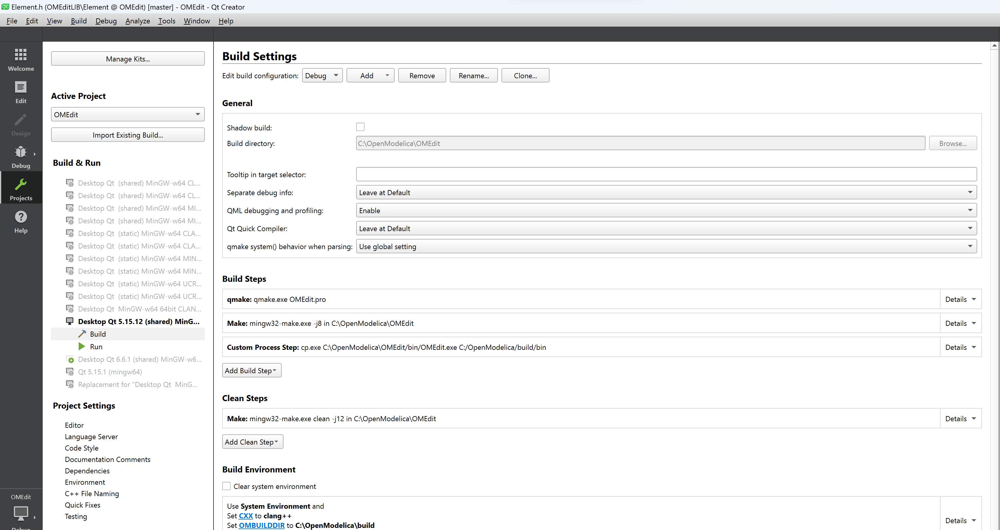

# OMEdit
A Modelica connection editor for OpenModelica.

## Dependencies

  - [OpenModelica Compiler](../OMCompiler)
  - [OMPlot](../OMPlot)
  - [OMSimulator](../../../../OMSimulator)

## Build instructions

Follow the instructions matching your OS:

  - [OMCompiler/README.Linux.md](../OMCompiler/README.Linux.md)
  - [OMCompiler/README.Windows.md](../OMCompiler/README.Windows.md)

### Rebuilding OMEdit only

The full OpenModelica build is the recommended way to prepare OMEdit and its
dependencies. For small OMEdit changes it is also possible to rebuild only
OMEdit, but the build still expects generated files and libraries from other
parts of the source tree to be available.

Use a complete source checkout, including `OMParser`, `OMPlot`,
`OMCompiler/3rdParty`, and `OMCompiler/Compiler/runtime`. Set `OMBUILDDIR` to
the OpenModelica build or install prefix that contains the compiler libraries
and headers. For example, this is often `../build` in a source build and `/usr`
inside a release Docker image.

Build `OMParser` before building OMEdit:

```sh
make -C OMParser \
  OMBUILDDIR=/path/to/openmodelica/build-or-install-prefix \
  host_short="$(gcc -dumpmachine)"
```

This generates the Modelica parser sources, including `modelicaLexer.h`, and
installs `libOMParser.a` and `libantlr4-runtime.a` under
`$OMBUILDDIR/lib/$host_short/omc`.

On Debian or Ubuntu based environments, make sure the Qt and parser tool
dependencies needed by OMEdit are installed. Package names vary by distribution,
but the following packages are commonly needed:

```sh
apt-get install -y \
  qtbase5-dev qttools5-dev-tools \
  libqt5webkit5-dev libqt5svg5-dev libqt5opengl5-dev \
  libopenscenegraph-dev \
  default-jre-headless antlr3 libantlr3-runtime-java
```

Then configure and build OMEdit against the same build or install prefix:

```sh
cd OMEdit
autoconf
./configure \
  --with-openmodelicahome=/path/to/openmodelica/build-or-install-prefix \
  --with-ombuilddir=/path/to/openmodelica/build-or-install-prefix

make -f Makefile.unix \
  ANTLRJAR=/usr/share/java/antlr3.jar:/usr/share/java/antlr3-runtime.jar:/usr/share/java/stringtemplate4.jar
```

Common partial rebuild failures usually mean that one of the generated artifacts
or source-tree dependencies above is missing:

  - `modelicaLexer.h: No such file or directory`: build `OMParser` first.
  - `/usr/bin/ld: cannot find -lOMParser`: check that `libOMParser.a` was
    installed under `$OMBUILDDIR/lib/$host_short/omc`.
  - `antlr-3.2.jar` or similar ANTLR jar errors: pass a valid `ANTLRJAR` value
    when invoking `make -f Makefile.unix`.
  - `OMPlot.h`, `fmilib.h`, or `settingsimpl.h` missing: use a complete source
    checkout and matching OpenModelica development headers.
  - `#include_next <stdlib.h>` errors from system headers: inspect the generated
    qmake flags and make sure `/usr/include` is not treated as an added
    third-party include directory.

### Compile/Debug from Qt Creator

Compile OMEdit once using the build instructions above so all dependencies of OMEdit are ready. Then follow these steps,

  - Load the `OMEdit.pro` file in Qt Creator.
  - Configure the project with the compiler you used to compile OMEdit earlier.
  - Go to project build settings in Qt Creator. Add a custom build step to copy executable `OMEdit` from `OpenModelica/OMEdit/bin` to `OpenModelica/build/bin`
  - Add the build environment variables `CXX` and `OMBUILDDIR`. `CXX` is only needed if your default is `gcc` and you want to use `clang`. `OMBUILDDIR` should point to `OpenModelica/build`.
  - Change the run settings to run the executable `OpenModelica/build/bin/OMEdit` instead of `OpenModelica/OMEdit/bin/OMEdit`.
  - Compile/debug OMEdit.


## Coding Style

  - 2 spaces not tab
  - CamelCase except that first letter should be small.
  - Member variables should start with `m` and member pointers should start with `mp`.
  - Local pointers should start with `p`.
  - Use meaningful name for variables and functions.


## Bug Reports

  - Submit bugs through the [OpenModelica GitHub issues](https://github.com/OpenModelica/OpenModelica/issues/new).
  - [Pull requests](https://github.com/OpenModelica/OpenModelica/pulls) are welcome ❤️
