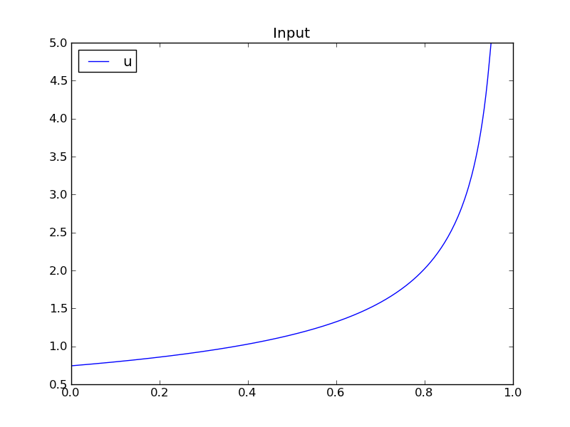
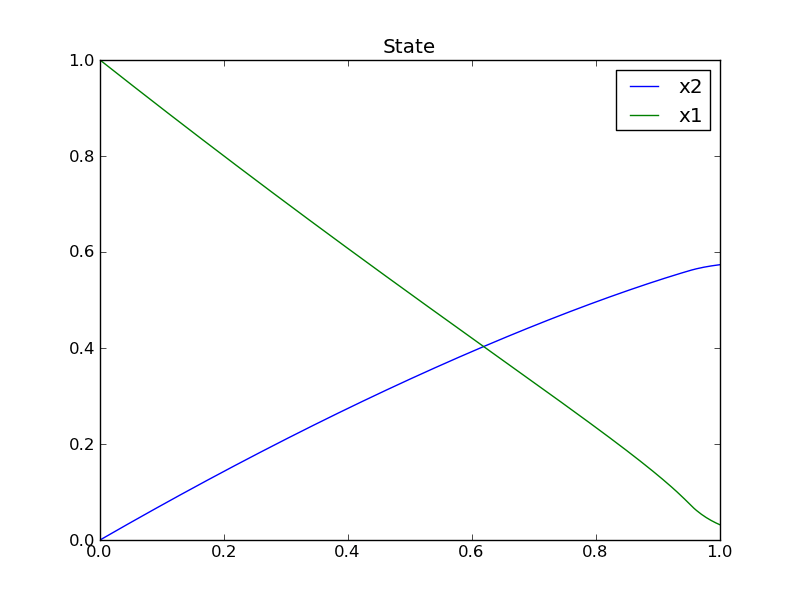

Optimization with OpenModelica
==============================

The following facilities for model-based optimization are provided with
OpenModelica:

-  :ref:`builtin-dynamic-optimization` using
       dynamic optimization is the recommended way of
       performing dynamic optimization with OpenModelica.

-  :ref:`dynamic-optimization-casadi`. Use this if you want to employ
       the CasADi tool for dynamic optimization.

-  Classical :ref:`parameter-sweep-optimization-using-omoptim`. Use
       this if you have a static optimization problem.

.. _builtin-dynamic-optimization :

Builtin Dynamic Optimization with OpenModelica and IpOpt
--------------------------------------------------------

*Note: this is a very short preliminary decription which soon will be
considerably improved.*

OpenModelica provides builtin dynamic optimization of models by using
the powerful symbolic machinery of the OpenModelica compiler for more
efficient and automatic solution of dynamic optimization problems.

The builtin dynamic optimization allows users to define optimal control
problems (OCP) using the Modelica language for the model and the
optimization language extension called Optimica (currently partially
supported) for the optimization part of the problem. This is used to
solve the underlying dynamic optimization model formulation using
collocation methods, using a single execution instead of multiple
simulations as in the parameter-sweep optimization described in section :ref:`parameter-sweep-optimization-using-omoptim`.

For more detailed information regarding background and methods, see :cite:`openmodelica.org:bernhard:modelica:2012,openmodelica.org:Ruge:modelica:2014`

Compiling the Modelica code
---------------------------

Before starting the optimization the model should be symbolically
instantiated by the compiler in order to get a single flat system of
equations. The model variables should also be scalarized. The compiler
frontend performs this, including syntax checking, semantics and type
checking, simplification and constant evaluation etc. are applied. Then
the complete flattened model can be used for initialization, simulation
and last but not least for model-based dynamic optimization.

The OpenModelica command optimize(ModelName) from OMShell, OMNotebook or
MDT runs immediately the optimization. The generated result file can be
read in and visualized with OMEdit or within OMNotebook.

An Example
----------

In this section, a simple optimal control problem will be solved. When
formulating the optimization problems, models are expressed in the
Modelica language and optimization specifications. The optimization
language specification allows users to formulate dynamic optimization
problems to be solved by a numerical algorithm. It includes several
constructs including a new specialized class optimization, a constraint
section, startTime, finalTime etc. See the optimal control problem for
batch reactor model below.

Create a new file named :ref:`BatchReactor.mo` and save it in you working
directory. Notice that this model contains both the dynamic system to be
optimized and the optimization specification.

Once we have formulated the undelying optimal control problems, we can
run the optimization by using OMShell, OMNotebook, MDT, OMEdit using
command line terminals similar to the options described below:

.. omc-mos ::

  setCommandLineOptions("-g=Optimica");

.. omc-loadstring ::
  :caption: BatchReactor.mo
  :name: BatchReactor.mo

  model BatchReactor
    Real x1(start =1, fixed=true, min=0, max=1);
    Real x2(start =0, fixed=true, min=0, max=1);
    input Real u(min=0, max=5);
  equation
    der(x1) = -(u+u^2/2)*x1;
    der(x2) = u*x1;
  end BatchReactor;

.. omc-loadstring ::

  optimization nmpcBatchReactor(objective=-x2)
    extends BatchReactor;
  end nmpcBatchReactor;

.. omc-mos ::

  optimize(nmpcBatchReactor, numberOfIntervals=16, stopTime=1, tolerance=1e-8)

The control and state trajectories of the optimization results:

.. omc-gnuplot :: nmpc-input
  :caption: Optimization results for Batch Reactor model – input variables.

  u

.. omc-gnuplot :: nmpc-states
  :caption: Optimization results for Batch Reactor model – state variables.

  x1
  x2

Different Options for the Optimizer IPOPT
-----------------------------------------

.. table :: New meanings of the usual simualtion options for Ipopt.

  +-----------------------+-------------------------+-------------------------+
  | numberOfIntervals     |                         | collocation intervals   |
  +-----------------------+-------------------------+-------------------------+
  | startTime, stopTime   |                         | time horizon            |
  +-----------------------+-------------------------+-------------------------+
  | tolerance = 1e-8      | e.g. 1e-8               | solver tolerance        |
  +-----------------------+-------------------------+-------------------------+
  | simflags              | all run/debug options   |                         |
  +-----------------------+-------------------------+-------------------------+

|

.. table :: New simulation options for Ipopt.

  +---------------------+------------------+-----------------------------------------+
  | -lv                 | LOG\_IPOPT       | console output                          |
  +---------------------+------------------+-----------------------------------------+
  | -ipopt\_hesse       | CONST,BFGS,NUM   | hessian approximation                   |
  +---------------------+------------------+-----------------------------------------+
  | -ipopt\_max\_iter   | number e.g. 10   | maximal number of iteration for ipopt   |
  +---------------------+------------------+-----------------------------------------+
  | externalInput.csv   |                  | input guess                             |
  +---------------------+------------------+-----------------------------------------+

.. _dynamic-optimization-casadi :

Dynamic Optimization with OpenModelica and CasADi
-------------------------------------------------

OpenModelica coupling with CasADi supports dynamic optimization of
models by OpenModelica exporting the optimization problem to CasADi
which performs the optimization. In order to convey the dynamic system
model information between Modelica and CasADi, we use an XML-based model
exchange format for differential-algebraic equations (DAE). OpenModelica
supports export of models written in Modelica and the Optimization
language extension using this XML format, while CasADi supports import
of models represented in this format. This allows users to define
optimal control problems (OCP) using Modelica and Optimization language
specifications, and solve the underlying model formulation using a range
of optimization methods, including direct collocation and direct
multiple shooting.

Compiling the Modelica code
~~~~~~~~~~~~~~~~~~~~~~~~~~~

Before exporting a model to XML, the model should be symbolically
instantiated by the compiler in order to get a single flat system of
equations. The model variables should also be scalarized. The compiler
frontend performs this, including syntax checking, semantics and type
checking, simplification and constant evaluation etc. are applied. Then
the complete flattened model is exported to XML code. The exported XML
document can then be imported to CasADi for model-based dynamic
optimization.

The OpenModelica command translateModelXML(ModelName) from OMShell,
OMNotebook or MDT exports the XML. The export XML command is also
integrated with OMEdit. Select XML > Export XML the XML document is
generated in the current directory of omc. You can use the cd() command
to see the current location. After the command execution is complete you
will see that a file ModelName.xml has been exported.

Assuming that the model is defined in the modelName.mo, the model can
also be exported to an XML code using the following steps from the
terminal window:

-  Go to the path where your model file found
-  Run command omc -g=Optimica --simCodeTarget=XML Model.mo

An example
~~~~~~~~~~

In this section, a simple optimal control problem will be solved. When
formulating the optimization problems, models are expressed in the
Modelica language and optimization specifications. The optimization
language specification allows users to formulate dynamic optimization
problems to be solved by a numerical algorithm. It includes several
constructs including a new specialized class optimization, a constraint
section, startTime, finalTime etc. See the optimal control problem for
batch reactor model below.

Create a new file named :ref:`BatchReactor.mo` and save it in you working
directory. Notice that this model contains both the dynamic system to be
optimized and the optimization specification.

.. omc-mos ::
  :parsed:

  list(BatchReactor)

One we have formulated the undelying optimal control problems, we can
export the XML by using OMShell, OMNotebook, MDT, OMEdit or command
line terminals which are described in Section :ref:`xml-import-to-casadi`.

To export XML, we set the simulation target to XML:

.. omc-mos ::

  translateModelXML(BatchReactor)

This will generate an XML file named :ref:`batchreactorxml` (:numref:`batchreactorxml`)
that contains a symbolic representation of the optimal control problem
and can be inspected in a standard XML editor.

.. literalinclude :: ../tmp/BatchReactor.xml
  :name: batchreactorxml
  :caption: BatchReactor.xml
  :language: xml

.. _xml-import-to-casadi :

XML Import to CasADi via OpenModelica Python Script
~~~~~~~~~~~~~~~~~~~~~~~~~~~~~~~~~~~~~~~~~~~~~~~~~~~

The symbolic optimal control problem representation (or just model
description) contained in BatchReactor.xml can be imported into CasADi
in the form of the SymbolicOCP class via OpenModelica python script.

The SymbolicOCP class contains symbolic representation of the optimal
control problem designed to be general and allow manipulation. For a
more detailed description of this class and its functionalities, we
refer to the API documentation of CasADi.

The following step compiles the model to an XML format, imports to
CasADi and solves an optimization problem in windows PowerShell:

1. Create a new file named BatchReactor.mo and save it in you working
   directory.

    E.g. C:\\OpenModelica1.9.2\\share\\casadi\\testmodel

1. Perform compilation and generate the XML file

   a. Go to your working directory

    E.g. cd C:\\OpenModelica1.9.2\\share\\casadi\\testmodel

a. Go to omc path from working directory and run the following command

    E.g. ..\\..\\..\\bin\\omc +s -g=Optimica --simCodeTarget=XML
    BatchReactor.mo

3. Run defaultStart.py python script from OpenModelica optimization
directory

E.g. Python.exe ..\\share\\casadi\\scripts defaultStart.py
BatchReactor.xml

The control and state trajectories of the optimization results are shown
below:

|casadi-input| |casadi-state|

.. _parameter-sweep-optimization-using-omoptim:

Parameter Sweep Optimization using OMOptim
------------------------------------------

OMOptim is a tool for parameter sweep design optimization of Modelica
models. By optimization, one should understand a procedure which
minimizes/maximizes one or more objective functions by adjusting one or
more parameters. This is done by the optimization algorithm performing a
parameter swep, i.e., systematically adjusting values of selected
parameters and running a number of simulations for different parameter
combinations to find a parameter setting that gives an optimal value of
the goal function.

OMOptim 0.9 contains meta-heuristic optimization algorithms which allow
optimizing all sorts of models with following functionalities:

-  One or several objectives optimized simultaneously

-  One or several parameters (integer or real variables)

However, the user must be aware of the large number of simulations an
optimization might require.

Preparing the Model
~~~~~~~~~~~~~~~~~~~

Before launching OMOptim, one must prepare the model in order to
optimize it.

Parameters
^^^^^^^^^^

An optimization parameter is picked up from all model variables. The
choice of parameters can be done using the OMOptim interface.

For all intended parameters, please note that:

-  The corresponding variable is **constant** during all simulations.
       The OMOptim optimization in version 0.9 only concerns static
       parameters’ optimization *i.e.* values found for these parameters
       will be constant during all simulation time.

-  The corresponding variable should play an **input** role in the model
       *i.e.* its modification influences model simulation results.

Constraints
^^^^^^^^^^^

If some constraints should be respected during optimization, they must
be defined in the Modelica model itself.

For instance, if mechanical stress must be less than 5 N.m\ :sup:`-2`,
one should write in the model:

.. code-block :: modelica

  assert(mechanicalStress < 5, "Mechanical stress too high");

If during simulation, the variable *mechanicalStress* exceeds 5
N.m\ :sup:`-2`, the simulation will stop and be considered as a failure.

Objectives
^^^^^^^^^^

As parameters, objectives are picked up from model variables.
Objectives’ values are considered by the optimizer at the *final time*.

Set problem in OMOptim
~~~~~~~~~~~~~~~~~~~~~~

Launch OMOptim
^^^^^^^^^^^^^^

OMOptim can be launched using the executable placed in
OpenModelicaInstallationDirectory/bin/ OMOptim/OMOptim.exe. Alternately,
choose OpenModelica > OMOptim from the start menu.

Create a new project
^^^^^^^^^^^^^^^^^^^^

To create a new project, click on menu File -> New project

Then set a name to the project and save it in a dedicated folder. The
created file created has a .min extension. It will contain information
regarding model, problems, and results loaded.

Load models
^^^^^^^^^^^

First, you need to load the model(s) you want to optimize. To do so,
click on *Add .mo* button on main window or select menu *Model -> Load
Mo file…*

When selecting a model, the file will be loaded in OpenModelica which
runs in the background.

While OpenModelica is loading the model, you could have a frozen
interface. This is due to multi-threading limitation but the delay
should be short (few seconds).

You can load as many models as you want.

If an error occurs (indicated in log window), this might be because:

-  Dependencies have not been loaded before (e.g. modelica library)

-  Model use syntax incompatible with OpenModelica.

**Dependencies**

OMOptim should detect dependencies and load corresponding files.
However, it some errors occur, please load by yourself dependencies. You
can also load Modelica library using Model->Load Modelica library.

When the model correctly loaded, you should see a window similar to :numref:`omoptim-loaded`.

.. figure :: media/omoptim-loaded.png
  :name: omoptim-loaded

  OMOptim window after having loaded model.

Create a new optimization problem
^^^^^^^^^^^^^^^^^^^^^^^^^^^^^^^^^

Problem->Add Problem->Optimization

A dialog should appear. Select the model you want to optimize. Only
Model can be selected (no Package, Component, Block…).

A new form will be displayed. This form has two tabs. One is called
Variables, the other is called Optimization.

.. figure :: media/omoptim-define-new-problem.png
  :name: omoptim-define-new-problem

  Forms for defining a new optimization problem.

**List of Variables is Empty**

If variables are not displayed, right click on model name in model
hierarchy, and select *Read variables*.

.. figure :: media/omoptim-setup-model.png
  :name: omoptim-setup-model

  Selecting read variables, set parameters, and selecting simulator.

Select Optimized Variables
^^^^^^^^^^^^^^^^^^^^^^^^^^

To set optimization, we first have to define the variables the optimizer
will consider as free *i.e.* those that it should find best values of.
To do this, select in the left list, the variables concerned. Then, add
them to *Optimized variables* by clicking on corresponding button
(|omoptim-blue-cross|).

For each variable, you must set minimum and maximum values it can take.
This can be done in the *Optimized variables* table.

Select objectives
^^^^^^^^^^^^^^^^^

Objectives correspond to the final values of chosen variables. To select
these last, select in left list variables concerned and click |omoptim-blue-cross|
button of *Optimization objectives* table.

For each objective, you must:

-  Set minimum and maximum values it can take. If a configuration does
       not respect these values, this configuration won’t be considered.
       You also can set minimum and maximum equals to “-“ : it will then

-  Define whether objective should be minimized or maximized.

This can be done in the *Optimized variables* table.

Select and configure algorithm
^^^^^^^^^^^^^^^^^^^^^^^^^^^^^^

After having selected variables and objectives, you should now select
and configure optimization algorithm. To do this, click on
*Optimization* tab.

Here, you can select optimization algorithm you want to use. In version
0.9, OMOptim offers three different genetic algorithms. Let’s for
example choose SPEA2Adapt which is an auto-adaptative genetic algorithm.

By clicking on *parameters*\ … button, a dialog is opened allowing
defining parameters. These are:

-  *Population size*: this is the number of configurations kept after a
       generation. If it is set to 50, your final result can’t contain
       more than 50 different points.

-  *Off spring rate*: this is the number of children per adult obtained
       after combination process. If it is set to 3, each generation
       will contain 150 individual (considering population size is 50).

-  *Max generations*: this number defines the number of generations
       after which optimization should stop. In our case, each
       generation corresponds to 150 simulations. Note that you can
       still stop optimization while it is running by clicking on *stop*
       button (which will appear once optimization is launched).
       Therefore, you can set a really high number and still stop
       optimization when you want without losing results obtained until
       there.

-  *Save frequency*: during optimization, best configurations can be
       regularly saved. It allows to analyze evolution of best
       configurations but also to restart an optimization from
       previously obtained results. A Save Frequency parameter set to 3
       means that after three generations, a file is automatically
       created containing best configurations. These files are named
       iteraion1.sav, iteration2.sav and are store in *Temp* directory,
       and moved to *SolvedProblems* directory when optimization is
       finished.

-  *ReinitStdDev*: this is a specific parameter of EAAdapt1. It defines
       whether standard deviation of variables should be reinitialized.
       It is used only if you start optimization from previously
       obtained configurations (using *Use start file* option). Setting
       it to yes (1) will, in most of cases, lead to a spread research
       of optimized configurations, forgetting parameters’ variations’
       reduction obtained in previous optimization.

**Use start file**

As indicated before, it is possible to pursue an optimization finished
or stopped. To do this, you must enable *Use start file* option and
select file from which optimization should be started. This file is an
*iteration\_.sav* file created in previous optimization. It is stored in
corresponding *SolvedProblems* folder (*iteration10.sav* corresponds to
the tenth generation of previous optimization).

***Note that this functionality can only work with same variables and
objectives*.** However, minimum, maximum of variables and objectives can
be changed before pursuing an optimization.

Launch
^^^^^^

You can now launch Optimization by clicking *Launch* button.

Stopping Optimization
^^^^^^^^^^^^^^^^^^^^^

Optimization will be stopped when the generation counter will reach the
generation number defined in parameters. However, you can still stop the
optimization while it is running without loosing obtained results. To do
this, click on *Stop* button. Note that this will not immediately stop
optimization: it will first finish the current generation.

This stop function is especially useful when optimum points do not vary
any more between generations. This can be easily observed since at each
generation, the optimum objectives values and corresponding parameters
are displayed in log window.

Results
~~~~~~~

The result tab appear when the optimization is finished. It consists of
two parts: a table where variables are displayed and a plot region.

Obtaining all Variable Values
^^^^^^^^^^^^^^^^^^^^^^^^^^^^^

During optimization, the values of optimized variables and objectives
are memorized. The others are not. To get these last, you must
recomputed corresponding points. To achieve this, select one or several
points in point’s list region and click on *recompute*.

For each point, it will simulate model setting input parameters to point
corresponding values. All values of this point (including those which
are not optimization parameters neither objectives).

Window Regions in OMOptim GUI
~~~~~~~~~~~~~~~~~~~~~~~~~~~~~

.. figure :: media/omoptim-window-regions.png

  Window regions in OMOptim GUI.

.. |omoptim-blue-cross| image:: media/omoptim-icons/Add.png
  :height: 12pt

.. omc-reset ::

.. bibliography:: openmodelica.bib extrarefs.bib
  :cited:
  :filter: docname in docnames
