.. _builtin-dynamic-optimization :

***********************************************
Built-in Dynamic Optimization using Annotations
***********************************************

*This part of the OM manual is a contribution by Massimo Ceraolo and
Vitalij Ruge.*

Foreword
========

Dynamic optimization using Annotations is the most user-friendly way to
perform Dynamic Optimization(DO) in OpenModelica, since it allows the OMEdit
graphical user interface to be used.

It is also more powerful that the Built-in Dynamic Optimization using
Optimica language extensions, since it allows final constraints.

Formulation limitations and algorithm
=====================================

We can formulate the optimization problem as follows:

.. math::
   :nowrap:

   \begin{eqnarray}
      \min_{u(t)}{\ \left\lbrack M\left( \mathbf{x}\left( t_{f} \right), \mathbf{u}\left( t_{f} \right),t_{f} \right) + \int_{t_{0}}^{t_{f}}{L\left( \mathbf{x}(t), \mathbf{u}(t),t \right)\text{dt}} \right\rbrack}
      &&
      \begin{array}[t]{l}
         \mbox{optimization purpose} \\
         (M \mbox{ \textit{is the Mayer Term}} \\
         L \mbox{  \textit{is the Lagrange Term}})
      \end{array}
      \\
      \mathbf{0} = \mathbf{f}\left( \mathbf{x}(t),\dot{\mathbf{x}}(t),\mathbf{u}(t),t \right)
      &&
      \begin{array}[t]{l}
         \mbox{dynamical description} \\
         \mbox{of the system}
      \end{array}
      \\
      \mathbf{0} \leq \mathbf{g}\left( \mathbf{x}(t),\mathbf{u}(t),t \right)
      &&
      \begin{array}[t]{l}
         \mbox{path constraints} \\
         \mbox{e.g. physical limits of components}
      \end{array}
      \\
      \mathbf{0} = \mathbf{r}_{0}\left( \mathbf{x}\left(t_{0} \right),t_{0} \right)
      &&
      \mbox{Initial constraint}
      \\
      \mathbf{0} = \mathbf{r}_{f}(\mathbf{x}\left( t_{f} \right)\mathbf{u}\left( t_{f} \right),t_{f})
      &&
      \mbox{Final constraint}
   \end{eqnarray}

Where **u**\ (*t*) is the vector of input variables, on which DO works
to try to get the desired minimum, and **x**\ (*t*) is the vector of
state variables.

The equations above can be implemented in OpenModelica using the full
power of Modelica language, and therefore there is a good freedom and
flexibility, under the obvious constraint that the system must be
regular enough for the convergence to take place.

However, there are limitations in the possibility operational limits can
be set.

The formulation of operational limits in (3) is general, since it allows
to use non-boxed constrains. Consider for instance a battery. The energy
the battery can deliver is a function of the power we use to charge or
discharge it. Therefore, the actual limit should be described as:

.. math:: E_{\min}(P) \leq E_{\text{bat}} \leq E_{\max}(P)

Moreover, (3) is time-variant (the third argument of function *g*).

The OpenModelica optimization through annotations accepts as path
constraints only time-invariant box constraints, so eq (3) is expressed
in the simpler form:

.. math:: \mathbf{x}_{\min} \leq \mathbf{x}(t) \leq \mathbf{x}_{\max}

.. math:: \mathbf{u}_{\min} \leq \mathbf{u}(t) \leq \mathbf{u}_{\max}

.. math:: g_{\min} \leq g(\mathbf{x}(t),\mathbf{u}(t)) \leq g_{\max}

OpenModelica uses the Radau IIA discretization scheme of order 1 or 5
depending on user input.

Using the first order the Radau IIA is equivalent to implicit Euler and
to compute states, output and cost function only the values at the end
of each interval are evaluated. E.g., if we have StopTime=1 and
Interval=0.25, only values for t=0.25, t=0.5, t=0.75, t=1 will be
considered. Therefore, the resulting value of the control variable at
t=0 may be even totally wrong, since it has no influence on the result.

Syntax
======

OpenModelica provides specific annotations to allow the optimization
problem to be described, as an alternative to the use of Optimica
language. They are listed and commented below.

-  *Request for an optimization*. We must use two simulation flags and a
   command line option. These can conveniently be inserted into the
   code, to avoid selecting them manually all the time, as follows:

   .. code-block :: modelica

      __OpenModelica_simulationFlags(s = "optimization", optimizerNP="1"),
      __OpenModelica_commandLineOptions = "+g=Optimica",

   OptimizerNP gives the number of colloction points and can be only 1
   or 3. As already said the RadauIIA order is 2*OptimizerNP-1.

   *The user is recommended to use as a first attempt optimizerNP=1. In
   case of questionable results, they can try optimizerNP=3.*

   For the simulation, it is known that the stability ranges are
   different. At the same time, we lose stability with higher order (see [1]_).

   Note that Optimica command-line option is added even if we do not use
   Optimica specific language constructs; this it is required for the
   use of optimization-related annotations.

-  *Select optimization parameters*. We must specify StartTime,
   StopTime, Interval, and Tolerance. The first two have the same
   meaning as in time simulations. Interval not only defines the output
   interval (as in time simulations), but has a more specific meaning:
   it defines the interval between two successive collocation points.
   I.e., optimization is done splitting the whole timespan in sparts
   having interval as length. Therefore this value may have a huge
   effects on the simulation output. For typical runs, number of
   intervals values from 100 to 1000-2000 could be adequate. These
   values are obviously set through the experiment annotation, e.g.:

   .. code-block :: modelica

      experiment(StartTime = 0, StopTime = 20, Tolerance = 1e-07, Interval = 0.02),

   the default tolerance is 1e-6. The user is warned that enlarging this
   value may affect the output quality adversely by large amounts (an
   example will be provided later). Going up to 1e-8 may be advisable in
   some cases.

-  *Indicate the minimisation goal*. We can indicate whether we must
   just minimise a quantity, or the integral of a quantity (see (1)., as
   follows:

   .. code-block :: modelica

      Real totalCost = xxx annotation(isMayer = true); //minimize totalCost(tf)
      Real specificCost = xxx annotation(isLagrange = true); //minimize integral of specificCost (tf)

   Several isMayer and isLagrange goals can be set. The actual goal will
   be the sum of all goals (isMayer goals as they are, isLagrange goals
   first integrated between *t*\ :sub:`0` and *t*\ :sub:`f`).

   Obviously, it is possible in Modelica to use just isMayer=true also
   for Lagrange terms, integrating the Laplace integrand inside the
   model, but the internal numeric treatment will be different.

-  *Describe the system*. This is done in the usual Modelica way. Here
   we can exploit the huge power of modelica language and tools to
   automatically convert a system described in physical (and possibly
   graphical) terms into DAE equations

-  *Define path constraints*. As we said previously, they must be boxed
   and time-invariant. They are expressed using annotations as in the
   following example (taken from the full example described in the next
   section):

   .. code-block :: modelica

         Real energyConstr(min = 0, max = energyMax) = storage.energy annotation(isConstraint = true); //timespan constraint on storage energy

   Here, we see that the constraints are described through min and max
   values.

-  *Define initial constraints*. These are set using the existing
   modelica syntax to indicate initial values

-  *Define final constraints*. These are set using a specific
   annotation, as in the following example (taken from the full example
   described in the next section):

   .. code-block :: modelica

      annotation(isFinalConstraint = true);

   Some special care must be taken when dealing with final constraints.
   We must be sure that OM front-end does not do alias elimination of
   the constrained variable, since in that case it could pass on bounds
   from final constraints to the merged variable, and these final
   constraints would become path constraints. To avoid this potentially
   harmful alias elimination we must add to the final constrant an
   auxiliary parameter, as follows.

   .. code-block :: modelica

      parameter Real p = 1 "Auxiliary parameter for energy final constraint";
      Real energyConstr(min = 0, max = energyMax) = storage.energy annotation(isConstraint = true); //timespan constraint on storage energy
      Real energyFinConstr(min = energyIni, max = energyIni) = p * storage.energy annotation(isFinalConstraint = true); //final time constraint on storage energy

   The auxiliary parameter can also be used for scaling the constrained
   variable, so that it is roughly around one, so easing convergence.
   This could be done for instance as follows:

   .. code-block :: modelica

      parameter Real p = 1e-3 "Auxiliary parameter for energy final constraint";
      Real energyConstr(min = 0, max = energyMax) = storage.energy annotation(isConstraint = true); //timespan constraint on storage energy
      Real energyFinConstr(min = p*energyIni, max = p*energyIni) = p * storage.energy annotation(isFinalConstraint = true); //final time constraint on storage energy

Preparing the system
====================

To allow DO to operate in good conditions it is very important that the
system has continuous derivatives.

Here we just give two examples:

-  In case of a combiTimeTable is used to describe non-linear algebraic
   functions, it is highly recommended to use Continuous derivative for
   the smoothness parameter

-  If we need to use the absolute value of a variable, we have
   derivative discontinuity around zero. This can be avoided, with
   negligible loss of precision, substituting :math:`abs(x)` with :math:`sqrt(x^2+\varepsilon)`,
   where eps is very low in comparison with the values :math:`x` usually assumes
   during the simulation.

Example 1: minimum time to destination
======================================

This example refers to a car, which is requested to cover the max
possible distance using power from an engine which has a torque
limitation and a power limitation.

The torque limitation is transformed in a maximum force that the wheels
can transfer to the road to pus the car.

This is a very easy dynamic optimization problem, whose solution is the
so-called bang-bang control: accelerate at the maximum possible degree,
then, when half of the road is reached, decelerate with the maximum
possible degree.

The code is very simple and it is as follows:

.. code-block :: modelica

   model BangBang2021 "Model to verify that optimization gives bang-bang optimal control"

      parameter Real m = 1;
      parameter Real p = 1 "needed for final constraints";

      Real a;
      Real v(start = 0);
      Real pos(start = 0);
      Real pow(min = -30, max = 30) = f * v annotation(isConstraint = true);

      input Real f(min = -10, max = 10);

      Real costPos(nominal = 1) = -pos "minimize -pos(tf)" annotation(isMayer=true);

      Real conSpeed(min = 0, max = 0) = p * v " 0<= p*v(tf) <=0" annotation(isFinalConstraint = true);

   equation

      der(pos) = v;
      der(v) = a;
      f = m * a;

   annotation(experiment(StartTime = 0, StopTime = 1, Tolerance = 1e-07, Interval = 0.01),
   __OpenModelica_simulationFlags(s="optimization", optimizerNP="1"),
   __OpenModelica_commandLineOptions="+g=Optimica");

   end BangBang2021;

The constraint on power is especially worth considering. Above, we
stated that path constraints are
:math:`0 \leq g(\mathbf{x}(t),\mathbf{u}(t))` here we have box limits on
pow, which is indeed a function of state variables as follows:

.. math:: - 30 \leq fv \leq 30\  = > \  - 30 \leq mav \leq 30

And *a* and *v* are two state variables. So, these are two box
constraints of the type
:math:`0 \leq \ g\left( \mathbf{x}(t),\mathbf{u}(t) \right)\ ` as
follows:

:math:`mav = m\text{\ x}_{1}\text{\ x}_{2} \geq - 30\ \ \ \ \ \ \ \ \ \ \ \ \ \ \ \ \ \ mav = m\text{\ x}_{1}\text{\ x}_{2} \leq \ 30`.

The results can be expressed in terms of force and power applied to the
vehicle. They are as follows:

|image1| |image2|

and they are as expected.

In this model we don’t use the Modelica capability to automatically
determine the system equations from the graphical description of a
system. In other words, the above general formulation
:math:`0 = f\left( \mathbf{x}(t),\dot{\mathbf{x}}(t),\mathbf{u}(t),t \right)`
is explicitly written as follows:

.. code-block :: modelica

   der(pos) = v;
   der(v) = a;

In the following example, we will use this capability extensively.

Example 2: hybrid vehicle minimum consumption
=============================================

This example refers to the electricity generation of a hybrid vehicle.
These vehicles can choose at any time which amount of the propulsion
power must be taken from a battery and which from the Internal
combustion engine.

In this example the engine can be switched ON and off without penalty,
so the DO can choose both when the ICE must be ON /OFF; and the power it
must deliver when it is ON.

Objective of the control is to minimise the fuel consumption. This must
be done keeping the energy inside the storage at the final time, equal
to the one at t=0 (otherwise it is easy to have zero consumption: just
keep the Internal Combustion Engine OFF all the time!)

For simplicity’s sake, the propulsion power, in this simple example is
taken as being a sine wave plus an offset (needed to make the average
positive). When the power is positive the wheels transfer power to the
road, when negative they recover it (storing it into the battery).

To find the optimum, a fuel consumption curve is added, as follows:

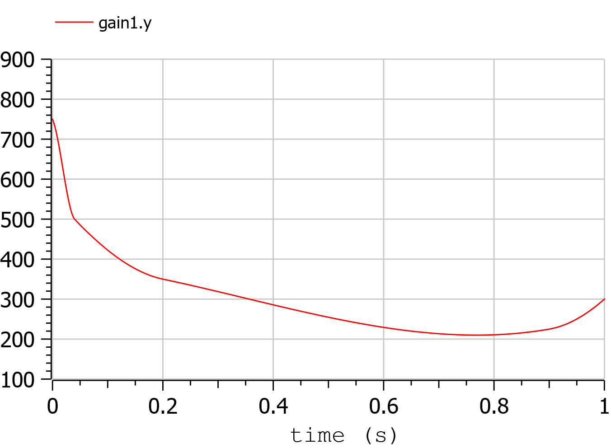

The minimum is 210 g/kWh, and occurs when the ICE power is at the 76.8 %
of the nominal power

The system diagram is as follows

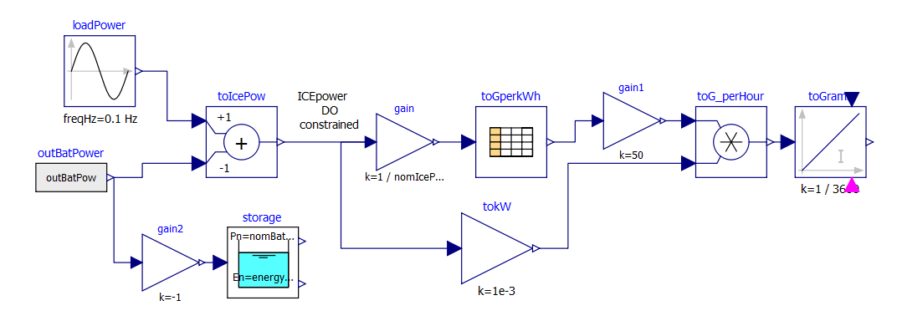

The DO algorithm is required to determine the battery power outBatPower
(positive when the battery delivers power) so that to minimise the fuel
consumption toGrams. Block toGperkWh is normalised, so that it can be
used for different engines, adapting the horizontal scale through gain,
and the vertical’s through gain1.

This diagram defines the system, whose equations will be automatically
determined by OpenModelica, through model flattening. However, some code
must be manually written to perform DO.

Here the code is as follows:

.. code-block :: modelica

   //*** DO-related rows

   input Real outBatPow;

   //
   Real totalCost = toGrams.y "minimize totalCost(tf)" annotation( isMayer=true);
   //

   Real energyConstr(min = 0, max = energyMax) = storage.energy annotation(isConstraint = true); //timespan constraint on storage energy

   parameter Real fecp = 1 "final energy constraint parameter";

   Real energyFinConstr(min = energyIni, max = energyIni) = fecp * storage.energy annotation(isFinalConstraint = true);//final time constraint on storage energy

   Real icePowerConstr(min = 0) = itoIcePow.y annotation(isConstraint=true); //timespan constraint on Ice power

   //*** End of DO-related rows

A few comments:

-  The choice isMayer=true on the objective function totalCost requires
   its final value to be actually minimised, not its integral (as would
   have been in case of the keyword isLaplace=true)

-  We have two different constraints on the storage energy: the storage
   energy must all the time be between 0 and the maximum allowed, and at
   the end of the simulation must be brought back to its initial value.

-  ICE can only deliver power, not absorb; so, we expect all the
   (regenerative) braking power and energy to be sent into the storage

Ideal storage
=============

Here we consider the storage to be ideal: the flow of power in and out
causes no losses to occur

In this case the solution of our optimization problem is trivial:

-  The Ice must supply the average power requested by the load, and when
   it does this it must do it at the optimal point which, as seen above
   is when its power is at the 76.8% of its nominal value

-  The battery supplies the load power minus ICE power.

Using iceNominalPower=60 kW we get the following output:

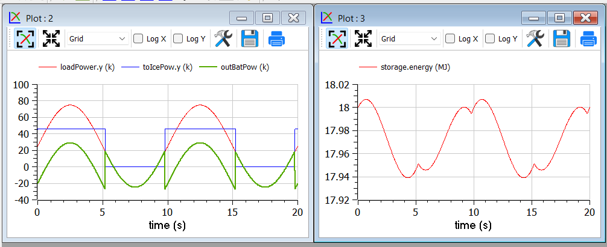

We see, as expected that the ICE is switched ON and OFF; and when it is
ON it delivers at its 76.8 % of nominal power, i.e. at 46.1 kW. The
battery delivers the difference, and when the load is negative absorbs
all the power from it. The control is such that the energy at the end of
the transient is the same as the one at t=0.

This result is good and confirms what we expected.

Effects of tolerance
^^^^^^^^^^^^^^^^^^^^

We mentioned that reduction of tolerance may affect the result adversely
by large, especially when the minimum, as in this case is very flat
(since the specific fuel consumption curve used for our example is very
flat).

In the following picture we see the result of the previous section as it
appears when we release tolerance by changing it from 1e-7 to and 1e-6.
Now the result is badly wrong (and the total cost has changed from to
25.6g 29.9g).

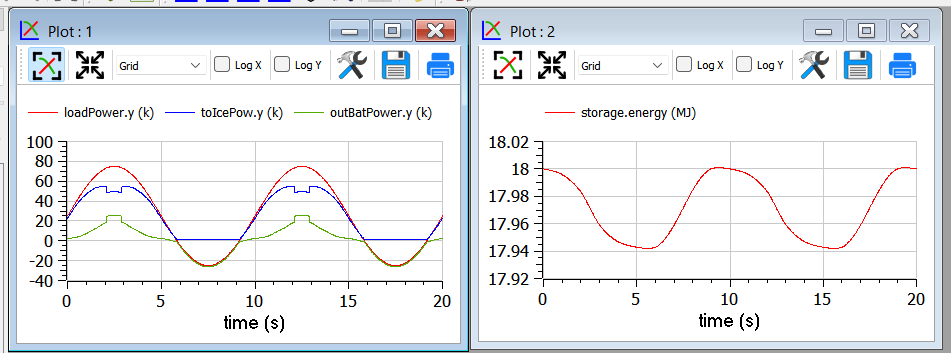

More realistic storage
^^^^^^^^^^^^^^^^^^^^^^

To the DO to be useful, it must obviously go beyond what is exactly
expected. Therefore, we repeat the simulation adding the simulation of
some losses inside the battery. According to scientific literature,
losses here are modelled through the following formula:

.. math:: L(t) = 0.03{|P}_{\text{batt}}(t)| + 0.04\frac{P_{\text{batt}}^{2}(t)}{P_{batt,nom}}

Which reflects that they in part are proportional to the absolute value
of battery current, partly to its square. The coefficients are typical
for power electronic converters interfacing a battery.

Inside the code, however, the formula introduced is structurally
different, since it has been transformed to avoid the derivative
discontinuity of the absolute value of a quantity around zero, using a
trick like the one reported in sect. 1.4.

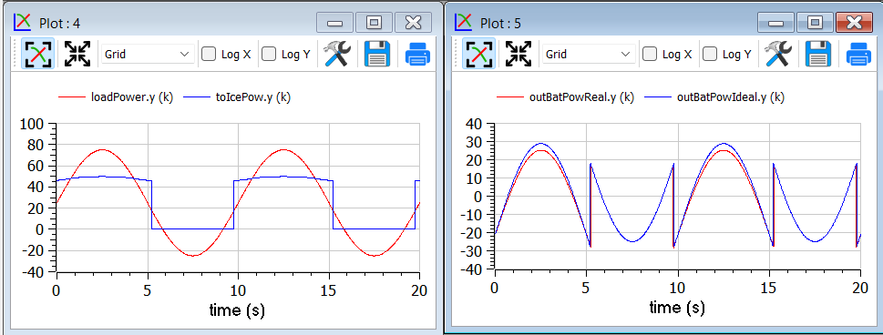

We see that now the optimiser changes the Ice power when in ON state, to
reduce the battery power at its peak, since the losses formula pushes
towards lower powers.

Adding storage power limitation
^^^^^^^^^^^^^^^^^^^^^^^^^^^^^^^

As a last case for example 2, we ass tome limitation on the power that
can be exchanged by the battery. This can be physically due to
limitations of either the battery or the inverter connected to it.

To show better the effect, we first rise the ICE power to 100 kW, so
that the interval of ICE operation is smaller:

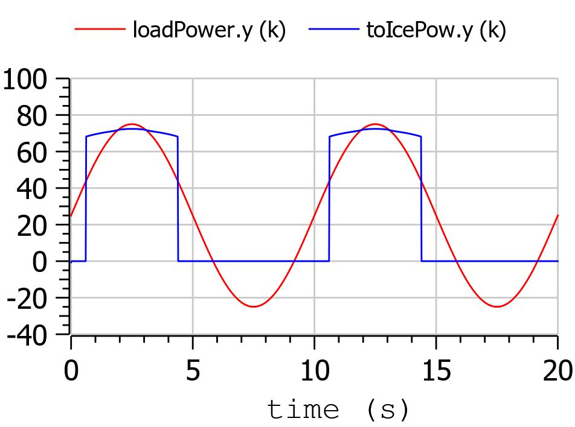

Then we change the following row of code:

.. code-block :: modelica

   input Real outBatPow;

into:

.. code-block :: modelica

   input Real outBatPow(min = -maxBatPower, max = maxBatPower);

where

.. code-block :: modelica

   parameter Modelica.SIunits.Power maxBatPower = 30e3;

giving rise to the following results (with a much longer computation
time than in the previous cases):

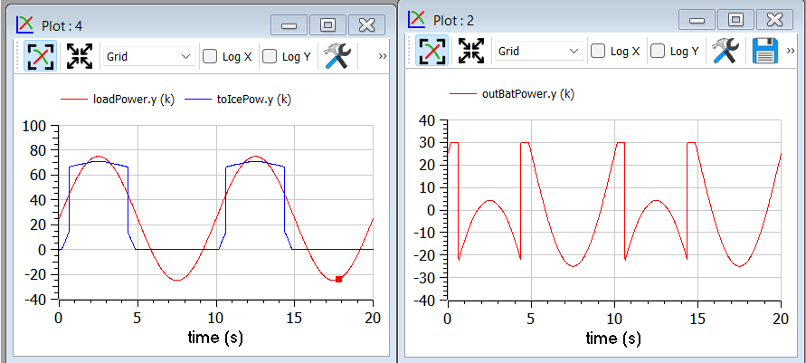

Example 3: Acausal vehicle
==========================

As a last example, we replicate the optimization of Example 2, but the
power to be delivered directly deriving from simulation of a vehicle,
modelled through its physical elements.

The considered diagram is as follows:

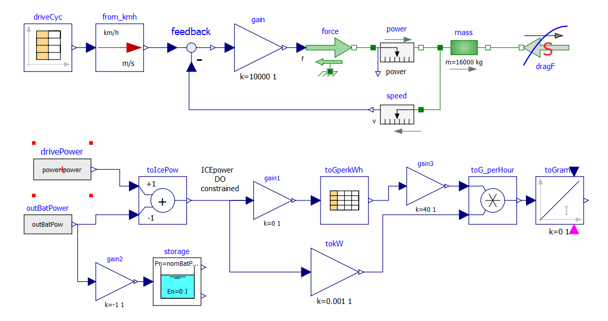

The upper part contains a vehicle model. The model follows a speed
profile defined by the drive cycle driveCyc, through a simple
proportional controller (simulating the driver). The power is applied to
a mass; the drag force dragF sis the force against the movement due to
friction (independent on speed) and air resistance (proportional to the
square of vehicle speed).

The lower part contains the management of the storage, and the
optimization algorithm, already discussed in example 2.

The results are shown in the following picture, where the obtained cost
(red curve) is compared to what obtainable in case the ICE is
continuously kept ON (blue curve), at a power (blue curve) that allows
the battery energy at the end of the simulation to be equal to the one
as t=0, as in the case of the optimised solution.

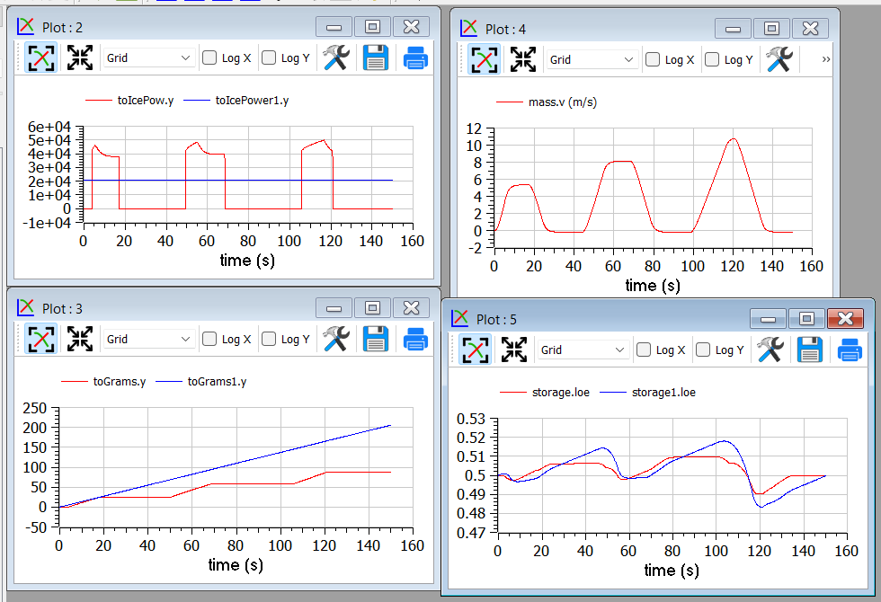

This example shows that the optimizer can find an ON/OFF strategy that
more than halves the hybrid vehicle fuel consumption.

The following plot shows the ICE power in comparison with total power
needed to cover the given trip profile mass.v. The rest is supplied by
the battery.

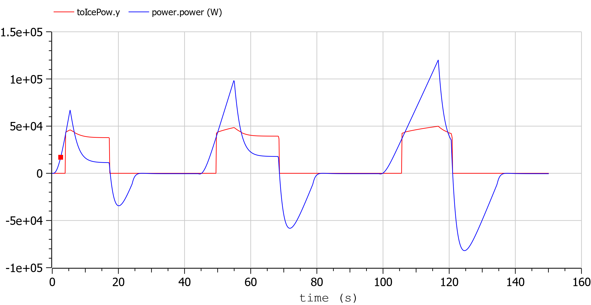

.. [1]
   Hairer, Ernst and Wanner, Gerhard, Radau Methods, 2015, pp 1213-1216,
   DOI 10.1007/978-3-540-70529-1_139.

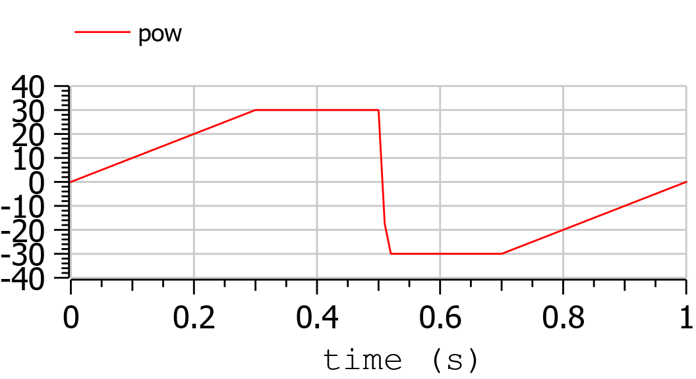
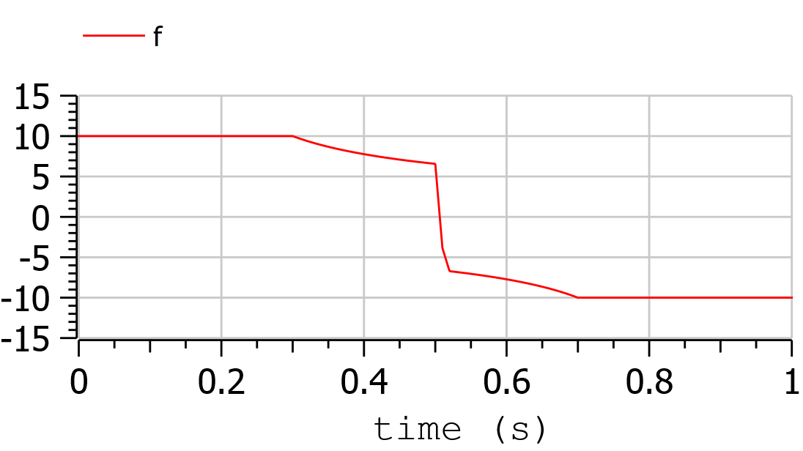
